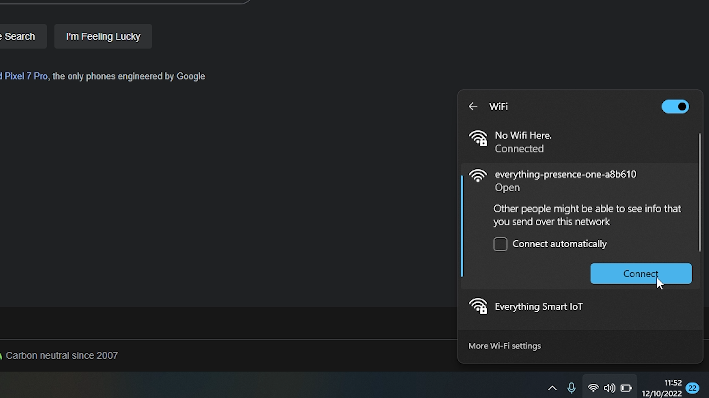
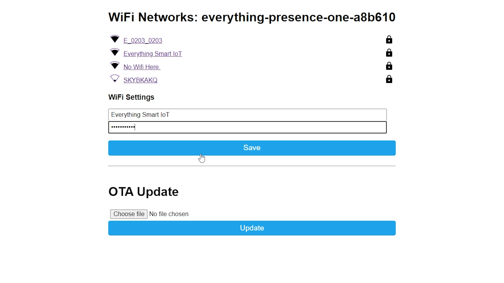

# Connecting To WiFi

{: .no_toc }

We can now power on for the first time and connect the EP1 to WiFi
{: .fs-6 .fw-300 }

## Powering On

You will want to grab a USB-C cable and a power brick - any charger should suffice, as power requirements are around 200 milliamps.

Plug the USB-C cable into the EP1 and a red light will illuminate on the front of the device.

## Joining Your WiFi

Once powered on, use your phone or computer to search for WiFi hotspots. The EP1 will show up as a hotspot named "everything-presence-one-xxxxxx" - connect to this hotspot.

Then, using a browser, navigate to http://192.168.4.1 - this will open up a webpage to configure WiFi settings.

Select your WiFi network and enter the password. The EP1 will now reboot and will join your WiFi network.

## Next Steps

With the EP1 connected to WiFi, the final step is to connect it to Home Assistant!

[Connecting to Home Assistant](http://everythingsmarthome.github.io/everything-presence-one/connecting-home-assistant.html){: .btn .btn-blue }

