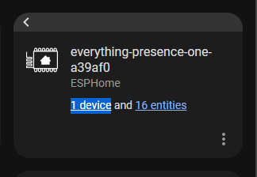
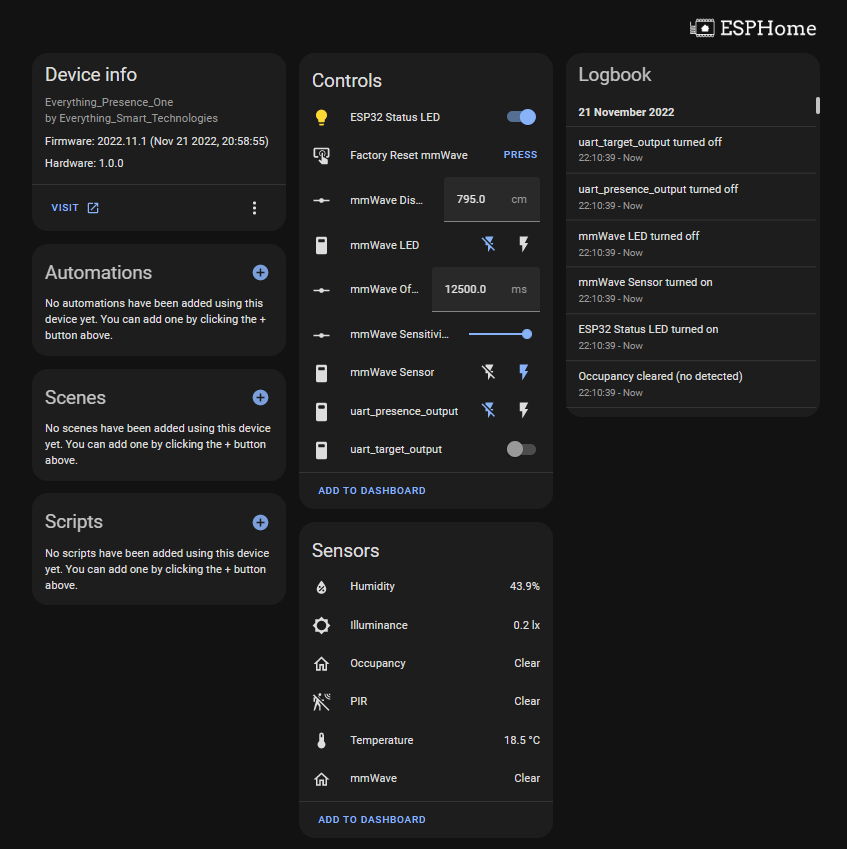
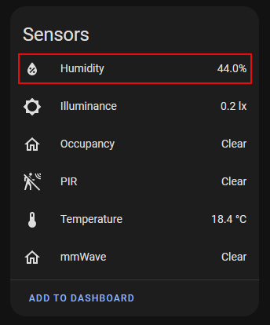
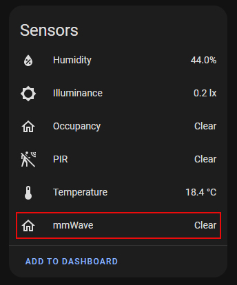
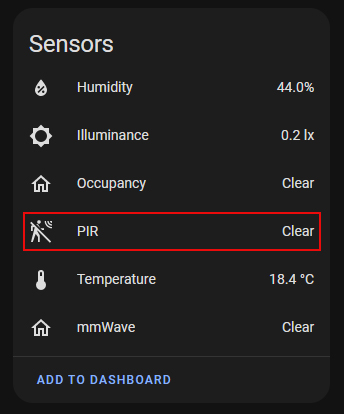
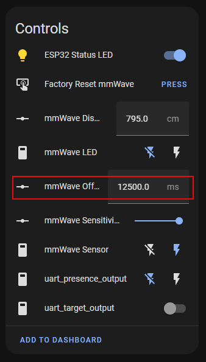
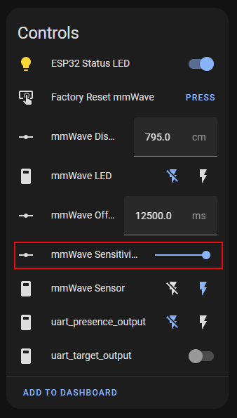
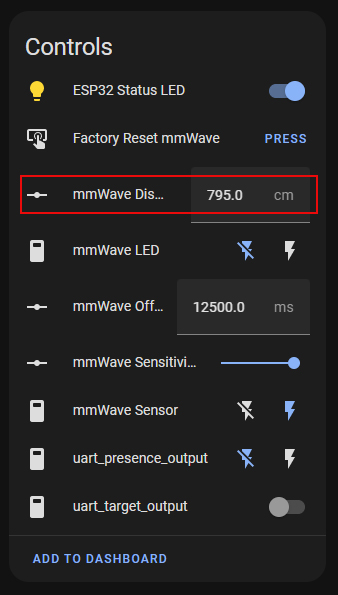
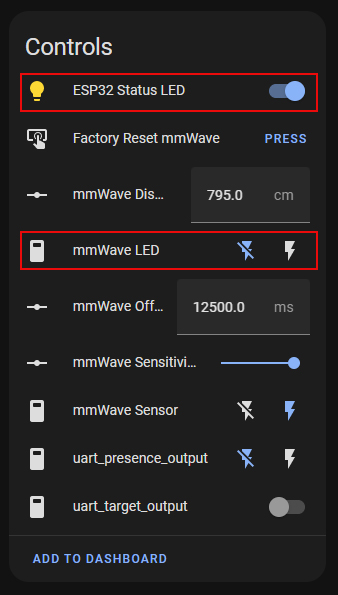

# Home Assistant Entities Explained

{: .no_toc }

What are all of these entities!?
{: .fs-6 .fw-300 }

## Home Assistant Entities

After adding the EP1 to Home Assistant, you may wonder which sensors you can use and what they do.

To view all of the sensors and entities, click on the device from the ESPHome menu:

This will show you a dashboard of all of the sensors and controls inside of Home Assistant that you can use in your Automations:

### Temperature, Humidity and Illuminance

Temperature is the current room temperature as measured by the on-board temperature sensor and is given in celsius. This sensor supports a configureable offset allowing you to adjust the reading. See the advanced section for how to do that.

Humidity gives a humidity sensor reading in percent for the room:

Illuminance is measured from the on-board light sensor in lux. There are slots at the side of the EP1 case that allow for light to pass-through and be measured, so make sure not to obstruct these for the best readings.

### mmWave, PIR and Occupancy

You will find a sensor called mmWave - this is the output from the mmWave sensor directly and indicates if movement is detected. The mmWave sensor has a configurable offset for the "Blind time" which we will cover below. The default blind time is 12.5 seconds, which is basically how long the sensor takes to go to an "Off" or "clear" state after motion has stopped being detected:

The PIR sensor indicates if motion was detected or not. It also has a user configurable timeout period, which by default is 10 seconds. This means that it will take 10 seconds after the last motion for the PIR sensor to go back to the "Off" or "Clear" state:

Occupancy is a combination of the mmWave and PIR sensor. If **either** the mmWave or PIR sensor detects motion, Occupancy will be "On" or "Detected". Both the mmWave and PIR sensor must be clear before Occupancy will change to the "Off" or "Clear" state. This is the sensor that you will generally want to use in your Automations. This also has a user configurable timeout period.

### Offsets for mmWave, PIR and Occupancy

All 3 sensors have configurable timeout periods that can be set, which allows you to fine-tune for your environment. 1 of these can be configured directly from the Home Assistant UI, and the other 2 require adjustments to the ESPHome code (ESPHome doesn't support UI sliders for these yet).

The mmWave sensor has an adjustable timeout period inside of Home Assistant using the mmWave Off Latency control. The value is measured in ms and the default is for 12500ms (12.5 seconds). I generally wouldn't recommend setting this below 10s.

The PIR and Occupancy sensor off-time needs to be configured with ESPHome code due to ESPHome not supporting dynamic values for these in code. See the Advanced page for how to edit the ESPHome code.

### Distance and Sensitivity

The mmWave sensor has a configurable Sensitivity and Distance control inside of Home Assistant.

Sensitivity allows you to adjust how sensitive the mmWave sensor reacts to movement - this can be useful to configure in rooms where slight movements by something not Human triggers the device (this cannot filter out non Human objects like fans or pets):

Distance allows you to adjust the max range of the sensor, up to a maximum of 8m. Please note that 8m is the max range, but doesn't nessecarily mean the sensor is capable of detecting the tiniest of movements at 8m - placement is still important for the best results:

### Turning off LEDs

The EP1 has two LED's that will be visible, both of which can be turned off.

The mmWave LED disables the LED on the mmWave sensor itself which flashes when in use and the ESP32 Status LED disables the LED on the EP1 board:

